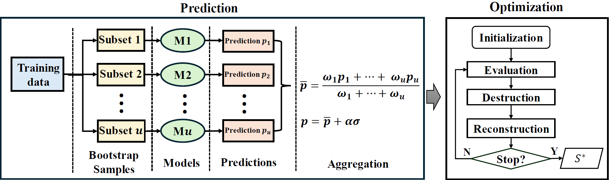
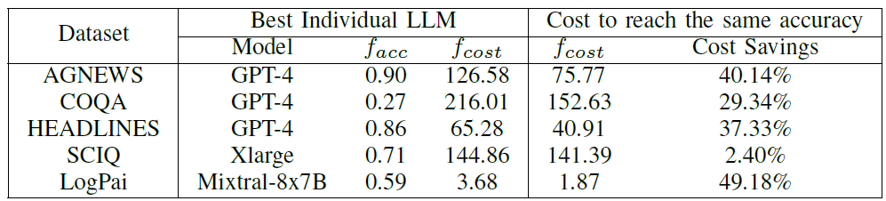
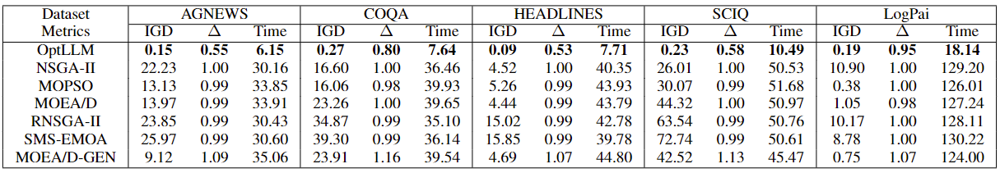
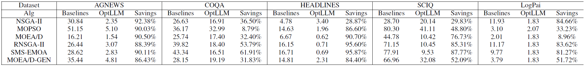
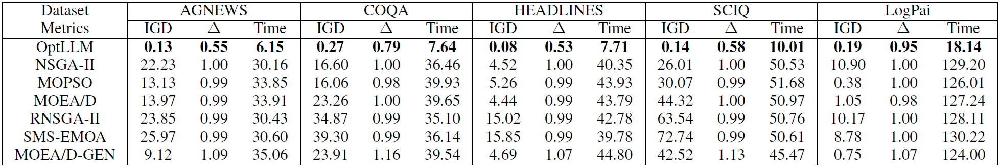
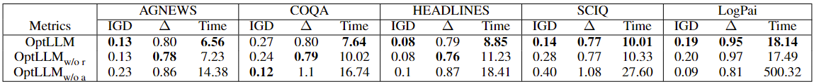
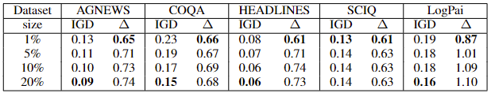
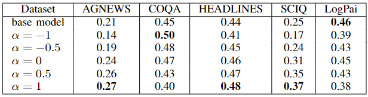
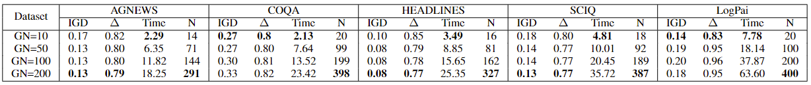

# OptLLM
Repository for the paper: OptLLM: Assigning Jobs to Large Language Models with Higher Accuracy at Lower Cost

Abstract: Large Language Models (LLMs) have garnered considerable attention owing to their remarkable capabilities, leading to an increasing number of companies offering LLMs as services. Different LLMs achieve different performance at different cost. A challenge for users lies in choosing the LLMs that best fit their needs, balancing cost and performance. In this paper, we propose a framework for addressing the cost-effective query allocation problem for LLMs. Given a set of input queries and candidate LLMs, our framework, named OptLLM, provides users with a range of optimal solutions to choose from, aligning with their budget constraints and performance preferences, including options for maximizing accuracy and minimizing cost. OptLLM predicts the performance of candidate LLMs on each query using a multi-label classification model with uncertainty estimation and then iteratively generates a set of non-dominated solutions by destructing and reconstructing the current solution. To evaluate the effectiveness of OptLLM, we conduct extensive experiments on various types of tasks, including text classification, question answering, sentiment analysis, reasoning, and log parsing. Our experimental results demonstrate that OptLLM substantially reduces costs by 2.40% to 49.18% while achieving the same accuracy as the best LLM. Compared to other multi-objective optimization algorithms, OptLLM improves accuracy by 2.94% to 69.05% at the same cost or saves costs by 8.79% and 95.87% while maintaining the highest attainable accuracy.
## 1. Framework

<p align="center"><br>An overview of OptLLM</p>

OptLLM, an efficient framework for selecting the most suitable LLM API for a given set of jobs, aiming to optimize cost and performance. OptLLM consists of two components: prediction and optimization.
The prediction component employs multi-label classification to predict the possibility of candidate LLMs processing each query successfully. To handle prediction uncertainty, OptLLM uses a weighted mean to aggregate bootstrap sample predictions and calculate the standard deviation across samples to quantify the uncertainty. The optimization component initializes with two extreme solutions: one with the highest predicted accuracy and another with the lowest cost. OptLLM then iteratively generates non-dominated solutions through a destruction and reconstruction process. 

## 2. Benchmarks
### 2.1 Natural Language Processing (NLP) jobs
To show the generality of OptLLM on different types of jobs, we have chosen four general natural language processing tasks, including text classification(AGNEWS^[1]), question answering (COQA^[2]), sentiment analysis (HEADLINES^[3]),  and reasoning(SCIQ^[4]). 12 candidate LLMs are selected from 4 mainstream providers: OpenAI (GPT-Curie, ChatGPT, GPT-3, and GPT-4), AI21 (J1-Large, J1-Grande, and J1-Jumbo), Anthropic (Xlarge and Medium), and EleutherAI (GPT-J, FAIRSEQ, and GPT-Neox). The raw data is provided by Chen et al.^[5], which contains the inputs (prompts) sent to the LLMs, ground truth references, LLM outputs, and cost. 

### 2.2 Domain-specific tasks
Furthermore, we have chosen an intelligent software engineering (SE) task, specifically focusing on LLM-based log parsing. We utilize log data sourced from the LogPai benchmark^[6,7] to interface with 8 LLM APIs, including TogertherAI (llama2_7b, llama2_13b, llama2_70b, Mixtral_8x7B, Yi_34B, and Yi_6B), AI21(J2-Mid and J2-Ultra).} The LogPai benchmark consists of log data from 16 systems, including distributed systems, supercomputers, operating systems, mobile systems, server applications, and standalone software. The raw data includes inputs (queries and full prompts) sent to the LLMs, ground truth references, LLM outputs, and the corresponding execution costs. The details of datasets are listed in Table.

## 3. Baselines and Parameter Setting
### 3.1 Baselines
#### 3.1.1 Individual LLM
We evaluate the performance of assigning all jobs to a single candidate LLM. We submit the entire set of jobs to each individual LLM and assess the resulting cost and the proportion of jobs that have been successfully completed.
#### 3.1.2 Multi-objective optimization algorithms
OptLLM utilizes a heuristic search-based algorithm in optimization. We compare the effectiveness of this algorithm with well-known multi-objective optimization algorithms, including the Non-dominated Sorting Genetic Algorithm (NSGA-\rom{2})^[8], Multi-objective Particle Swarm Optimisation (MOPSO)^[9], and Multi-objective Evolutionary Algorithm with Decomposition (MOEA/D)^[10]. These three algorithms have been extensively studied and have proven to be effective in solving a wide range of multi-objective optimization problems. In addition, three variants of classic algorithms are also compared, including R-NSGA-\rom{2}^[11], SMS-EMOA^[12], and MOEA/D-GEN^[13]. It is important to note that all the evaluated multi-objective optimization algorithms are integrated with the same prediction component as OptLLM, to enable a fair comparison of the optimization strategies. 
### 3.2 Parameter Setting
Optuna is a widely used hyperparameter optimization package. To ensure the effectiveness and efficiency of all algorithms, we conduct parameter tuning using Optuna to choose optimal parameter settings. Based on the experiments, the parameters of algorithms are set as follows:

| Algorithm  | Parameter Settings                                                                                                                |
|------------|-----------------------------------------------------------------------------------------------------------------------------------|
| NSGA-II    | crossover_prob: 0.7780, crossover_eta: 7, mutation_prob: 0.8119, mutation_eta: 9, sampling: 'LHS', selection: 'TournamentSelection' |
| R-NSGA-II  | epsilon: 0.9964                                                                                                                   |
| SMS-EMOA   | crossover_prob: 0.7595, crossover_eta: 5, mutation_prob: 0.0675, mutation_eta: 28, sampling: 'FloatRandomSampling'                |
| MOEA/D     | weight_generation: 'grid', decomposition: 'bi', neighbours: 10                                                                    |
| MOEA/D-GEN | weight_generation: 'random', decomposition: 'tchebycheff', neighbours: 24                                                         |
| MOPSO      | omega: 0.7887, c1: 0.7497, c2: 0.1537, v_coeff: 0.9518                                                                            |

The record of the tunning process is available under `OptLLM/parameter_setting/res` directory.
## 4 Results
### 4.1 Metrics 
#### 4.1 Evaluating single solution performance
When assessing the performance of a single solution, such as submitting all jobs to an individual LLM, a direct comparison of the optimization objectives is feasible. 
- $f_{cost}$: total cost of invoking LLM APIs
- $f_{acc}$: the percentage of jobs processed accurately
#### 4.2 Multi-objective optimization evaluation metrics
- Inverted Generational Distance (IGD): The IGD metric is used to measure the distance between the obtained solution set and the Pareto front (reference point set). A lower value of IGD represents a better performance.</p>

- $\Delta$ metric: The $\Delta$ metric assesses the diversity and distribution of solutions across the Pareto front by measuring Euclidean distances between solutions and two extreme solutions.

- Computation time: The time for obtaining the solution set, calculated by minute.</p>

### 4.2 Resutls and Analysis
To verify the comparison, we conduct a statistical test to evaluate the performance of OptLLM and the baselines. We use the following statistical tests:

Friedman Test: The Friedman test is a non-parametric statistical test that ranks the algorithms for each dataset separately. It tests the null hypothesis that all algorithms perform equally well. If the null hypothesis is rejected, it means that there are significant differences among the algorithms' performances.

Nemenyi Test: The Nemenyi test is a post-hoc test that is performed after the Friedman test if the null hypothesis is rejected. It is used to determine which specific pairs of algorithms have significant differences in their performance.
#### 4.2.1 RQ1: Comparison with the baselines
##### 4.2.1.1 Results
<p align="center"><br>Cost savings by OptLLM compared with the individual LLM</p>

<p align="center"><br>The solution with the highest accuracy by all algorithms</p>

<p align="center"><br>Cost ($f_{cost}$) savings by OptLLM to match the baseline's performance</p>

<p align="center"><br>Comparisons of solution sets from all algorithms in terms of IGD, $\Delta$, and Time</p>

##### 4.2.1.2 Statistical Test

The Friedman test is a non-parametric statistical test used to compare multiple paired samples. The test is based on ranking the data within each block (i.e., each sample) and comparing the average ranks between the different groups. The following table shows the p-values of the Friedman test for the five datasets on IGD and $\Delta$ metrics.


Friedman test results for IGD metric:

| Dataset    | AGNEWS   | COQA | HEADLINES | SCIQ     | LogPai   |
|------------|----------|--------|-----------|----------|----------|
| P-value    | 2.42e-10 |6.95e-10 | 4.31e-9   | 1.59e-10 | 6.20e-11 |


Friedman test results for $\Delta$ metric:

| Dataset    | AGNEWS  | COQA | HEADLINES | SCIQ    | LogPai  |
|------------|---------|--------|-----------|---------|---------|
| P-value    | 4.68e-8 |3.67e-10| 4.50e-7   | 5.81e-9 | 2.55e-6 |

Overall, the Friedman test results for all five datasets show extremely small p-values, indicating strong evidence against the null hypothesis. This suggests that there are significant differences between the groups being compared for each dataset. The results provide compelling evidence to reject the null hypothesis and accept the alternative hypothesis that at least one group differs from the others.

#### 4.2.2 RQ2: Effect of Core Techniques
<p align="center"><br>Ablation study of OptLLM</p>

#### 4.2.3 RQ3: Effect of Hyper-Parameter Setting
##### 4.2.3.1 The training data size of prediction component
<p align="center"><br>Results under different training data sizes</p>

##### 4.2.3.2  The robustness parameter ``` α ```:
<p align="center"><br>Accuracy of prediction model with different $\alpha$</p>


##### 4.2.3.3  The grid parameter ``` GN```:
<p align="center"><br>Comparison of OptLLM with different settings of GN (N: number of generated solutions)</p>

## 5. Requirements
All the code is available under `LocalSearch` directory.
### 5.1 Library
1. Python 3.11
2. Pymoo
3. tiktoken

4. ...

To install all libraries:
$ pip install -r requirements.txt

### 5.2 How to run OptLLM
$ python main.py $

### 5.3 Source code
All source code is available under `OptLLM/igs` directory.

We used the standard version of NSGA-II, R-NSGA-II and SMS-EMOA implemented in the Pymoo library^[14], and MOPSO and MOEA/D in the Pygmo. 
The source code of the baselines is available under `OptLLM/baselines` directory.

| script       | Description                                                               |
| ------------ |---------------------------------------------------------------------------|
| `nsga2.py`   | Non-dominated Sorting Genetic Algorithm (NSGA-II)                         |
| `rnsga2.py`  | Reference point based Non-dominated Sorting Genetic Algorithm (R-NSGA-II) |
| `smsemoa.py` | SMS-EMOA                                                                  |
| `moead.py`   | Multi-objective EA with Decomposition (MOEA/D)                            |
| `moeadgen.py`| MOEA/D-GEN                                                                |
| `mopso.py`   | Multi-objective Particle Swarm Optimization (MOPSO)                       |

## Reference

[^1]: Zhang, Xiang, Junbo Zhao, and Yann LeCun. "Character-level convolutional networks for text classification." Advances in neural information processing systems 28 (2015).
[^2]: Reddy, Siva, Danqi Chen, and Christopher D. Manning. "Coqa: A conversational question answering challenge." Transactions of the Association for Computational Linguistics 7 (2019): 249-266.
[^3]: Sinha, Ankur, and Tanmay Khandait. "Impact of news on the commodity market: Dataset and results." Advances in Information and Communication: Proceedings of the 2021 Future of Information and Communication Conference (FICC), Volume 2. Springer International Publishing, 2021.
[^4]: Welbl, Johannes, Nelson F. Liu, and Matt Gardner. "Crowdsourcing multiple choice science questions." arXiv preprint arXiv:1707.06209 (2017).
[^5]: Chen, Lingjiao, Matei Zaharia, and James Zou. "Frugalgpt: How to use large language models while reducing cost and improving performance." arXiv preprint arXiv:2305.05176 (2023).
[^6]: Zhu, Jieming, et al. "Tools and benchmarks for automated log parsing." 2019 IEEE/ACM 41st International Conference on Software Engineering: Software Engineering in Practice (ICSE-SEIP). IEEE, 2019.
[^7]: Khan, Zanis Ali, et al. "Guidelines for assessing the accuracy of log message template identification techniques." Proceedings of the 44th International Conference on Software Engineering. 2022.
[^8]: Meyarivan, T., Kalyanmoy Deb, Amrit Pratap, and Sameer Agarwal. "A fast and elitist multiobjective genetic algorithm: NSGA-II." IEEE Trans Evol Comput 6, no. 2 (2002): 182-197.
[^9]: Coello, CA Coello, and Maximino Salazar Lechuga. "MOPSO: A proposal for multiple objective particle swarm optimization." Proceedings of the 2002 Congress on Evolutionary Computation. CEC'02 (Cat. No. 02TH8600). Vol. 2. IEEE, 2002.
[^10]: Zhang, Qingfu, and Hui Li. "MOEA/D: A multiobjective evolutionary algorithm based on decomposition." IEEE Transactions on evolutionary computation 11.6 (2007): 712-731.
[^11]: Deb, Kalyanmoy, and Jayavelmurugan Sundar. "Reference point based multi-objective optimization using evolutionary algorithms." Proceedings of the 8th annual conference on Genetic and evolutionary computation. 2006.
[^12]: Beume, Nicola, Boris Naujoks, and Michael Emmerich. "SMS-EMOA: Multiobjective selection based on dominated hypervolume." European Journal of Operational Research 181.3 (2007): 1653-1669.
[^13]: Wang, Zhenkun, Yew-Soon Ong, and Hisao Ishibuchi. "On scalable multiobjective test problems with hardly dominated boundaries." IEEE Transactions on Evolutionary Computation 23.2 (2018): 217-231.
[^14]: J. Blank and K. Deb, “pymoo: Multi-objective optimization in python”, IEEE Access, vol. 8, pp. 89 497–89 509, 2020.

