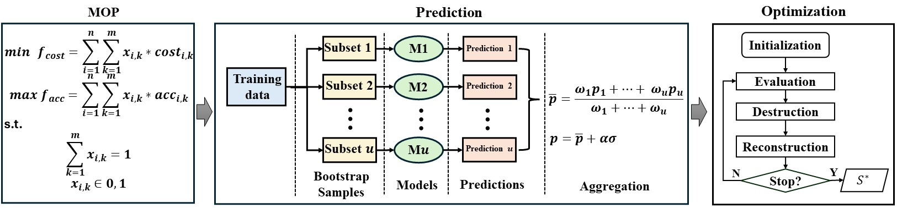

# OptLLM
Repository for the paper: OptLLM: Assigning Jobs to Large Language Models with Higher Accuracy at Lower Cost

Abstract: Large Language Models (LLMs) have garnered considerable attention owing to their remarkable capabilities, leading to an increasing number of companies offering LLMs as services. Different LLMs achieve different performance at different costs. A challenge for users lies in choosing the LLM that best fits their needs, balancing cost and performance. In this paper, we propose a framework for addressing the cost-effective job allocation problem for LLMs. Given a set of input queries and candidate LLMs, our framework, named OptLLM, provides users with a range of optimal solutions to choose from, aligning with their budget constraints and performance preferences, including options for maximizing accuracy and minimizing costs. OptLLM is a framework that predicts the performance of candidate LLMs on each job using a multi-label classification model with uncertainty estimation, and then iteratively generates a set of Pareto-optimal solutions by destroying and reconstructing the current solution. To evaluate the effectiveness of our approach, we conduct extensive experiments on various types of jobs, including text classification, question answering, sentiment analysis, reasoning, and log parsing. Our experimental results demonstrate that OptLLM substantially reduces costs by 2.40% to 49.18% while achieving the same accuracy as the best LLM. Compared to multi-objective optimization algorithms, OptLLM improves accuracy by 2.94% to 47.92% or saves costs by 9% to 90% while maintaining the highest attainable accuracy.

## 1. Framework

<p align="center"><br>An overview of OptLLM</p>

OptLLM, an efficient framework for selecting the most suitable LLM API for a given set of jobs, aiming to optimize cost and performance. We formulate this as a multi-objective optimization problem and propose a two-component framework: prediction and optimization. The prediction component of OptLLM employs multi-label classification to predict the probability of candidate LLMs successfully processing each job. To account for uncertainty in the predictions, OptLLM applies a robust-aware predicted accuracy in the selection process during optimization. The optimization component initializes with generating two extreme solutions: one with the highest predicted accuracy and another with the lowest cost. It then iteratively generates non-dominated solutions through destruction and reconstruction.

## 2. Benchmarks
### 2.1 Natural Language Processing (NLP) jobs
To show the generality of OptLLM on different types of jobs, we have chosen four general natural language processing tasks, including text classification(AGNEWS[^1]), question answering (COQA[^2]), sentiment analysis (HEADLINES[^3]),  and reasoning(SCIQ[^4]). 12 candidate LLMs are selected from 4 mainstream providers: OpenAI (GPT-Curie, ChatGPT, GPT-3, and GPT-4), AI21 (J1-Large, J1-Grande, and J1-Jumbo), Anthropic (Xlarge and Medium), and EleutherAI (GPT-J, FAIRSEQ, and GPT-Neox). The raw data is provided by Chen et al.^[5], which contains the inputs (prompts) sent to the LLMs, ground truth references, LLM outputs, and cost. 

### 2.2 Domain-specific tasks
Furthermore, we have chosen an intelligent software engineering (SE) task, specifically focusing on LLM-based log parsing. We utilize log data sourced from the LogPai benchmark[^6],[^7] to interface with 8 LLM APIs, including TogertherAI (llama2_7b, llama2_13b, llama2_70b, Mixtral_8x7B, Yi_34B, and Yi_6B), AI21(J2-Mid and J2-Ultra).} The LogPai benchmark consists of log data from 16 systems, including distributed systems, supercomputers, operating systems, mobile systems, server applications, and standalone software. The raw data includes inputs (queries and full prompts) sent to the LLMs, ground truth references, LLM outputs, and the corresponding execution costs. The details of the datasets are listed in Table.

## 3 Results
### 3.1 Metrics
- Inverted Generational Distance (IGD): The IGD metric is used to measure the distance between the obtained solution set and the Pareto front (reference point set). A lower value of IGD represents a better performance.</p>

- $\Delta$ metric: The $\Delta$ metric assesses the diversity and distribution of solutions across the Pareto front by measuring Euclidean distances between solutions and two extreme solutions.

- Computation time: The time for obtaining the solution set, calculated by minute.</p>

### 3.2 RQ1: Comparison with the baselines
<p align="center"><br>Cost savings by OptLLM comparing with the individual LLM</p>

<p align="center"><br>Results comparison among algorithms</p>

<p align="center"><br>The solution with the highest accuracy by all algorithms</p>


### 3.3 RQ2: Effect of Core Techniques
<p align="center"><br>Ablation study of OptLLM</p>

### 3.4 RQ3: Effect of Hyper-Parameter Setting
#### 3.4.1 The training data size of prediction component
<p align="center"><br>Results under different training data size</p>

#### 3.4.2 The robustness parameter ``` α ```:
<p align="center"><br>Accuracy of prediction model with different $\alpha$</p>

#### 3.4.3 The grid parameter ``` GN```:
<p align="center"><br>Comparison of OptLLM with different settings of GN</p>

## 4. Requirements
All the code is available under `OptLLM` directory.
### 4.1 Library
1. Python 3.11
2. Pymoo
3. tiktoken

4. ...

To install all libraries:
$ pip install -r requirements.txt

### 4.2 How to run OptLLM
$ python main.py $

### 4.3 Source code
All source code is available under `OptLLM/igs` directory.

We used the standard version of NSGA-II, R-NSGA-II and SMS-EMOA implemented in the Pymoo library[^8], and MOPSO and MOEA/D in the Pygmo. 
The source code of the baselines is available under `OptLLM/baselines` directory.

| script       | Description                                                               |
| ------------ |---------------------------------------------------------------------------|
| `nsga2.py`   | Non-dominated Sorting Genetic Algorithm (NSGA-II)                         |
| `rnsga2.py`  | Reference point based Non-dominated Sorting Genetic Algorithm (R-NSGA-II) |
| `smsemoa.py` | SMS-EMOA                                                                  |
| `moead.py`   | Multi-objective EA with Decomposition (MOEA/D)                            |
| `moeadgen.py`| MOEA/D-GEN                                                                |
| `mopso.py`   | Multi-objective Particle Swarm Optimization (MOPSO)                       |

## Reference

[^1]: Zhang, Xiang, Junbo Zhao, and Yann LeCun. "Character-level convolutional networks for text classification." Advances in neural information processing systems 28 (2015).
[^2]: Reddy, Siva, Danqi Chen, and Christopher D. Manning. "Coqa: A conversational question answering challenge." Transactions of the Association for Computational Linguistics 7 (2019): 249-266.
[^3]: Sinha, Ankur, and Tanmay Khandait. "Impact of news on the commodity market: Dataset and results." Advances in Information and Communication: Proceedings of the 2021 Future of Information and Communication Conference (FICC), Volume 2. Springer International Publishing, 2021.
[^4]: Welbl, Johannes, Nelson F. Liu, and Matt Gardner. "Crowdsourcing multiple choice science questions." arXiv preprint arXiv:1707.06209 (2017).
[^5]: Chen, Lingjiao, Matei Zaharia, and James Zou. "Frugalgpt: How to use large language models while reducing cost and improving performance." arXiv preprint arXiv:2305.05176 (2023).
[^6]: Zhu, Jieming, et al. "Tools and benchmarks for automated log parsing." 2019 IEEE/ACM 41st International Conference on Software Engineering: Software Engineering in Practice (ICSE-SEIP). IEEE, 2019.
[^7]: Khan, Zanis Ali, et al. "Guidelines for assessing the accuracy of log message template identification techniques." Proceedings of the 44th International Conference on Software Engineering. 2022.
[^8]: J. Blank and K. Deb, “pymoo: Multi-objective optimization in python”, IEEE Access, vol. 8, pp. 89 497–89 509, 2020.

