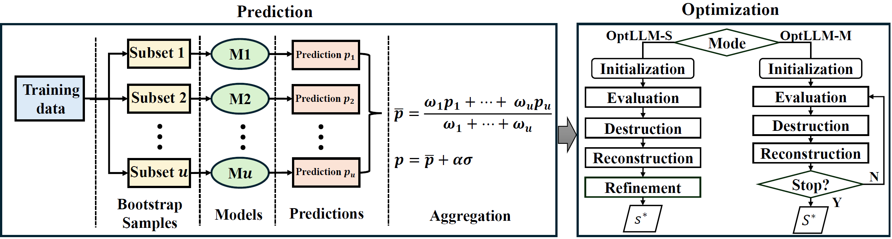

# OptLLM
OptLLM is a comprehensive framework designed to optimize the allocation of queries to LLM services. It considers both the cost of invocation and performance metrics to provide the best possible query distribution. OptLLM operates in two modes:
- **OptLLM-S**: Focuses on a single-objective optimization, prioritizing either cost or performance.
- **OptLLM-M**: Employs a multi-objective optimization strategy, balancing both cost and performance to achieve an optimal trade-off. OptLLM also incorporates robust aware prediction to achieve good prediction performance with a small training data size.

## 1. Framework

 An overview of OptLLM

The framework comprises two components: prediction and optimization. 

The prediction component employs multi-label classification to predict the possibility of candidate LLMs processing each query successfully. To handle prediction uncertainty, OptLLM uses a weighted mean to aggregate bootstrap sample predictions and calculates the standard deviation across samples to quantify the uncertainty. 

While the optimization component differs in implementation between the two modes, it shares core techniques. OptLLM-S shares the destruction and reconstruction with OptLLM-M but includes an additional refinement stage to target solutions that fully utilize the given budget or reach the expected accuracy.
## 2. Benchmarks

### 2.1 Natural Language Processing (NLP) jobs
To show the generality of OptLLM on different types of jobs, we have chosen four general natural language processing tasks, including text classification(AGNEWS[1]), question answering (COQA[2]), sentiment analysis (HEADLINES[3]),  and reasoning(SCIQ[4]). 12 candidate LLMs are selected from 4 mainstream providers: OpenAI (GPT-Curie, ChatGPT, GPT-3, and GPT-4), AI21 (J1-Large, J1-Grande, and J1-Jumbo), Anthropic (Xlarge and Medium), and EleutherAI (GPT-J, FAIRSEQ, and GPT-Neox). The raw data is provided by Chen et al.[5], which contains the inputs (prompts) sent to the LLMs, ground truth references, LLM outputs, and cost. 

### 2.2 Domain-specific tasks
Furthermore, we have chosen an intelligent software engineering (SE) task, specifically focusing on LLM-based log parsing. We utilize log data sourced from the LogPai benchmark[6,7] to interface with 8 LLM APIs, including TogertherAI (llama2_7b, llama2_13b, llama2_70b, Mixtral_8x7B, Yi_34B, and Yi_6B), AI21(J2-Mid and J2-Ultra).} The LogPai benchmark consists of log data from 16 systems, including distributed systems, supercomputers, operating systems, mobile systems, server applications, and standalone software. The raw data includes inputs (queries and full prompts) sent to the LLMs, ground truth references, LLM outputs, and the corresponding execution costs. The details of datasets are listed in Table.

## 3. Baselines Parameter Setting

Optuna is a widely used hyperparameter optimization package. To ensure the effectiveness and efficiency of all algorithms, we conduct parameter tuning using Optuna to choose optimal parameter settings. Based on the experiments, the parameters of algorithms are set as follows:

| Algorithm  | Parameter Settings                                                                                                                |
|------------|-----------------------------------------------------------------------------------------------------------------------------------|
| NSGA-II    | crossover_prob: 0.7780, crossover_eta: 7, mutation_prob: 0.8119, mutation_eta: 9, sampling: 'LHS', selection: 'TournamentSelection' |
| R-NSGA-II  | epsilon: 0.9964                                                                                                                   |
| SMS-EMOA   | crossover_prob: 0.7595, crossover_eta: 5, mutation_prob: 0.0675, mutation_eta: 28, sampling: 'FloatRandomSampling'                |
| MOEA/D     | weight_generation: 'grid', decomposition: 'bi', neighbours: 10                                                                    |
| MOEA/D-GEN | weight_generation: 'random', decomposition: 'tchebycheff', neighbours: 24                                                         |
| MOPSO      | omega: 0.7887, c1: 0.7497, c2: 0.1537, v_coeff: 0.9518                                                                            |

The record of the tunning process is available under the `OptLLM/parameter_setting/res` directory.
## 4 Additional Results

### 4.1 Statistical Analysis
To verify the comparison, we conduct a statistical test to evaluate the performance of OptLLM and the baselines. We use the following statistical tests:

Friedman Test: The Friedman test is a non-parametric statistical test that ranks the algorithms for each dataset separately. It tests the null hypothesis that all algorithms perform equally well. If the null hypothesis is rejected, it means that there are significant differences among the algorithms' performances.

Nemenyi Test: The Nemenyi test is a post-hoc test that is performed after the Friedman test if the null hypothesis is rejected. It is used to determine which specific pairs of algorithms have significant differences in their performance.

##### 4.1.1 Statistical Test on OptLLM-S

Friedman test: Accuracy improvement achieved by OptLLM-S compared to individual LLMs:

| Dataset    | AGNEWS   | COQA | HEADLINES | SCIQ     | LogPai   |
|------------|----------|--------|-----------|----------|----------|
| P-value    | 2.42e-10 |6.95e-10 | 4.31e-9   | 1.59e-10 | 6.20e-11 |

Friedman test: Comparisons between OptLLM-S and Single Objective Optimization Algorithms in Cost and Savings

| Dataset    | AGNEWS  | COQA    | HEADLINES | SCIQ     | LogPai   |
|------------|---------|---------|-----------|----------|----------|
| P-value    | 4.54e-5 | 4.54e-5 | 4.54e-5  | 4.54e-5  | 4.54e-5  |

Conclusion: the p-value indicates the differences observed between the compared groups are statistically significant. In the comparison for the OptLLM-S with single objective optimization algorithms, the ranking of the algorithms might be extremely consistent across all datasets. 

##### 4.1.2 Statistical Test on OptLLM-M

The following table shows the p-values of the Friedman test for the five datasets on IGD and $\Delta$ metrics.

Friedman test results for IGD metric:

| Dataset    | AGNEWS   | COQA | HEADLINES | SCIQ     | LogPai   |
|------------|----------|--------|-----------|----------|----------|
| P-value    | 2.42e-10 |6.95e-10 | 4.31e-9   | 1.59e-10 | 6.20e-11 |

Friedman test results for $\Delta$ metric:

| Dataset    | AGNEWS  | COQA | HEADLINES | SCIQ    | LogPai  |
|------------|---------|--------|-----------|---------|---------|
| P-value    | 4.68e-8 |3.67e-10| 4.50e-7   | 5.81e-9 | 2.55e-6 |

Conclusion: overall, the Friedman test results for all five datasets show extremely small p-values, indicating strong evidence against the null hypothesis. This suggests that there are significant differences between the groups being compared for each dataset. The results provide compelling evidence to reject the null hypothesis and accept the alternative hypothesis that at least one group differs from the others.

[//]: # (### 4.2 Ablation Study on OptLLM-S)

## 5. Requirements
All the code is available under the `LocalSearch` directory.
### 5.1 Library
1. Python 3.11
2. Pymoo
3. tiktoken

4. ...

To install all libraries:
$ pip install -r requirements.txt

### 5.2 How to run OptLLM
$ python main.py $

### 5.3 Source code
All source code is available under the `OptLLM/igs` directory.

We used the standard version of NSGA-II, R-NSGA-II and SMS-EMOA implemented in the Pymoo library[14], and MOPSO and MOEA/D in the Pygmo. 
The source code of the baselines is available under `OptLLM/baselines` directory.

| script       | Description                                                               |
| ------------ |---------------------------------------------------------------------------|
| `nsga2.py`   | Non-dominated Sorting Genetic Algorithm (NSGA-II)                         |
| `rnsga2.py`  | Reference point based Non-dominated Sorting Genetic Algorithm (R-NSGA-II) |
| `smsemoa.py` | SMS-EMOA                                                                  |
| `moead.py`   | Multi-objective EA with Decomposition (MOEA/D)                            |
| `moeadgen.py`| MOEA/D-GEN                                                                |
| `mopso.py`   | Multi-objective Particle Swarm Optimization (MOPSO)                       |

[//]: # (## Citation)

## Reference

[1]: Zhang, Xiang, Junbo Zhao, and Yann LeCun. "Character-level convolutional networks for text classification." Advances in neural information processing systems 28 (2015).

[2]: Reddy, Siva, Danqi Chen, and Christopher D. Manning. "Coqa: A conversational question answering challenge." Transactions of the Association for Computational Linguistics 7 (2019): 249-266.

[3]: Sinha, Ankur, and Tanmay Khandait. "Impact of news on the commodity market: Dataset and results." Advances in Information and Communication: Proceedings of the 2021 Future of Information and Communication Conference (FICC), Volume 2. Springer International Publishing, 2021.

[4]: Welbl, Johannes, Nelson F. Liu, and Matt Gardner. "Crowdsourcing multiple choice science questions." arXiv preprint arXiv:1707.06209 (2017).

[5]: Chen, Lingjiao, Matei Zaharia, and James Zou. "Frugalgpt: How to use large language models while reducing cost and improving performance." arXiv preprint arXiv:2305.05176 (2023).

[6]: Zhu, Jieming, et al. "Tools and benchmarks for automated log parsing." 2019 IEEE/ACM 41st International Conference on Software Engineering: Software Engineering in Practice (ICSE-SEIP). IEEE, 2019.

[7]: Khan, Zanis Ali, et al. "Guidelines for assessing the accuracy of log message template identification techniques." Proceedings of the 44th International Conference on Software Engineering. 2022.

[8]: Meyarivan, T., Kalyanmoy Deb, Amrit Pratap, and Sameer Agarwal. "A fast and elitist multiobjective genetic algorithm: NSGA-II." IEEE Trans Evol Comput 6, no. 2 (2002): 182-197.

[9]: Coello, CA Coello, and Maximino Salazar Lechuga. "MOPSO: A proposal for multiple objective particle swarm optimization." Proceedings of the 2002 Congress on Evolutionary Computation. CEC'02 (Cat. No. 02TH8600). Vol. 2. IEEE, 2002.

[10]: Zhang, Qingfu, and Hui Li. "MOEA/D: A multiobjective evolutionary algorithm based on decomposition." IEEE Transactions on evolutionary computation 11.6 (2007): 712-731.

[11]: Deb, Kalyanmoy, and Jayavelmurugan Sundar. "Reference point based multi-objective optimization using evolutionary algorithms." Proceedings of the 8th annual conference on Genetic and evolutionary computation. 2006.

[12]: Beume, Nicola, Boris Naujoks, and Michael Emmerich. "SMS-EMOA: Multiobjective selection based on dominated hypervolume." European Journal of Operational Research 181.3 (2007): 1653-1669.

[13]: Wang, Zhenkun, Yew-Soon Ong, and Hisao Ishibuchi. "On scalable multiobjective test problems with hardly dominated boundaries." IEEE Transactions on Evolutionary Computation 23.2 (2018): 217-231.

[14]: J. Blank and K. Deb, “pymoo: Multi-objective optimization in python”, IEEE Access, vol. 8, pp. 89 497–89 509, 2020.

